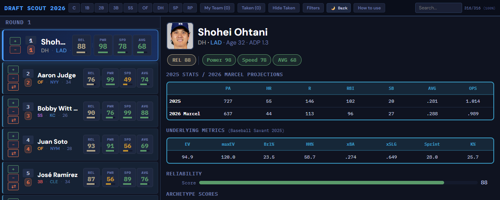
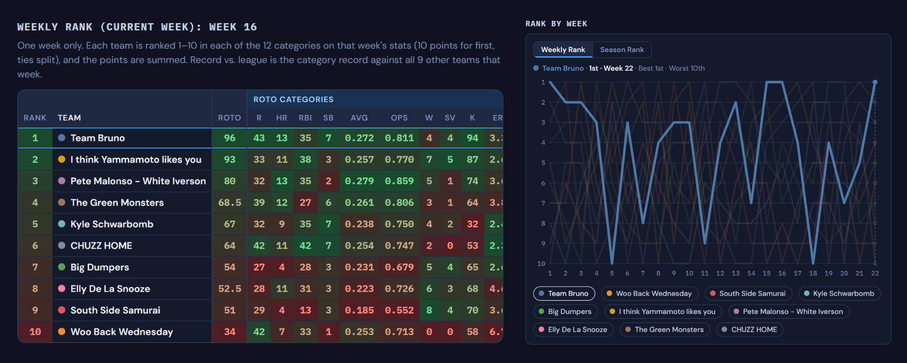
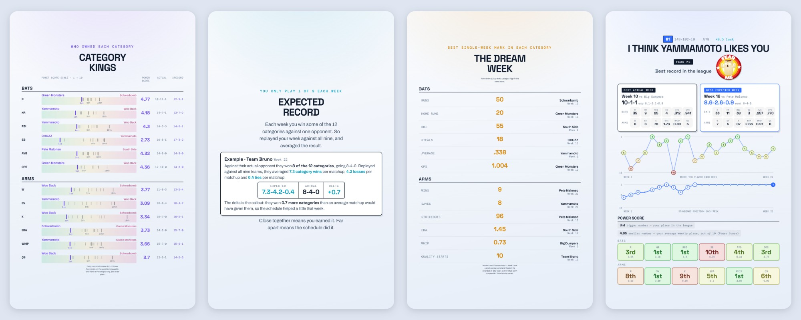

# brunoball

I play in a 10-team, head-to-head categories fantasy baseball league
with friends ([league rules](LEAGUE_RULES.md)). Over the 2026 season
I built a few tools for it: a [draft tool](https://mike-morreale-14.github.io/brunoball/draft-tool/) the whole league could use 
before and during the draft, [weekly power rankings](https://mike-morreale-14.github.io/brunoball/power-rankings/) for the group chat, 
and an [end-of-season recap](https://mike-morreale-14.github.io/brunoball/wrapped/) to commemorate the year.

## Draft Scout

A draft tool that lists the top 300 players by FantasyPros ADP.
Hitters are scored on Power, Speed and AVG, and starting
pitchers on Anchor, K Arm and Volatility, so you can see what
role a player would fill on your team. Scores blend 2026
projections (Tom Tango's Marcel method), 2025 stats and Statcast
skills, and you can adjust the weights as you draft.

**[Try the draft tool](https://mike-morreale-14.github.io/brunoball/draft-tool/)**
· [How it works](draft-tool/) · [Data pipeline](data-pipeline/)

## Weekly Power Rankings

I posted power rankings to the league group chat every week. The rankings
use roto scoring, a standard technique to eliminate schedule luck.
Weekly Rank shows one week, and Season Rank blends every week, with
recent weeks counting most.

**[View the rankings](https://mike-morreale-14.github.io/brunoball/power-rankings/)**
· [How it works](power-rankings/)

## Season Wrapped

A slideshow recap of the regular season for the league, inspired by Spotify
Wrapped, with the best and worst weeks, schedule luck and a slide for each team.

**[View the slides](https://mike-morreale-14.github.io/brunoball/wrapped/)**
· [About the recap](wrapped/)

## Replication

In progress: replicating well respected baseball analysis with updated data, an experiment to see how prior results trend as the league shifts over time. 

## Exploration

In progress: Trading research and new in-season visuals.

## AI Assistance

Claude Code is used in the project to write code and automate workflows.
