# Draft Scout 2026: user guide

This guide walks through every control in Draft Scout, area by area. Each section starts with a screenshot with numbered yellow callouts, followed by a list with the same numbers. For each control I describe what it is, what it does and what you should see change when you use it. It describes the tool; it doesn't tell you who to draft.

Screenshots were taken at 1280 × 800 (laptop) and 390 px wide (phone).

**Contents**
1. [Header and top bar](#1-header-and-top-bar)
2. [Main player list](#2-main-player-list)
3. [Player page](#3-player-page)
4. [Score weights and sliders](#4-score-weights-and-sliders)
5. [Filters, search and position chips](#5-filters-search-and-position-chips)
6. [Draft tracking](#6-draft-tracking)
7. [Compare](#7-compare)
8. [Settings and phone view](#8-settings-and-phone-view)
- [What the scores mean](#what-the-scores-mean)
- [What's saved between visits](#whats-saved-between-visits)

---

## 1. Header and top bar

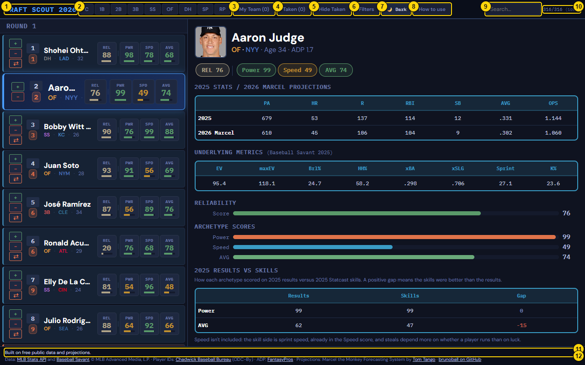

1. **Title.** Draft Scout 2026. It's a label and does nothing when clicked.
2. **Position chips** (C, 1B, 2B, 3B, SS, OF, DH, SP, RP). They narrow the list to those positions. See [section 5](#5-filters-search-and-position-chips).
3. **My Team (n).** Opens and closes the My Team panel. The number counts the players you've marked as your picks. See [section 6](#6-draft-tracking).
4. **Taken (n).** Opens and closes the draft board. The number counts every pick you've recorded, yours and everyone else's.
5. **Hide Taken.** Hides players that other teams have taken from the list.
6. **Filters.** Opens and closes the filters panel. It turns orange when a filter is active and the panel is closed.
7. **Theme button** (🌙 Dark / ☀️ Light). Switches between the dark and light themes. See [section 8](#8-settings-and-phone-view).
8. **How to use.** Opens this guide on GitHub in a new tab.
9. **Search box.** Filters the list by player name as you type.
10. **Player count.** Shows how many players are in the list now, out of the whole pool, with the share in brackets (for example `316/316 (100%)`). It updates whenever a filter, chip, search or Hide Taken changes the list.
11. **Footer line.** The first line of the footer: "Built on free public data and projections."
12. **Credits.** The data sources and their owners, with links: MLB Stats API and Baseball Savant (MLB Advanced Media), the Chadwick Baseball Bureau register (ODC-By), FantasyPros ADP and Tom Tango's Marcel. The last link goes to the brunoball repository.

---

## 2. Main player list

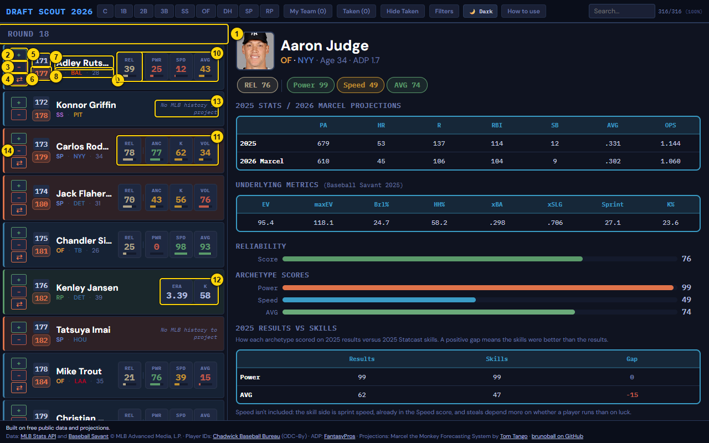

The list holds every player with a FantasyPros ADP of 300 or better, **sorted by ADP** (average draft position), lowest first. There's no other sort order. Hitters, starting pitchers and relievers are mixed together in one list.

1. **Round divider.** The draft round the players below it fall in by ADP rank, assuming a 10-team league (ranks 1–10 are Round 1, 11–20 Round 2 and so on). It stays pinned at the top of the list as you scroll. With a filter on, a divider appears wherever the round changes, so rounds with no matching players are skipped.
2. **+ (my pick).** Marks the player as your pick. The button fills green, the card fades, and the player appears in My Team and on the draft board. Click it again to undo. Picks are saved in your browser (see [What's saved](#whats-saved-between-visits)).
3. **− (taken).** Marks the player as taken by another team. The button fills red, the card fades more, and the player appears on the draft board. Click it again to undo. If you press + on a player marked −, or the other way round, the mark switches and the pick keeps its place in the draft order.
4. **⇄ (compare).** It appears on the other cards once a player is open. It opens a side-by-side comparison with the open player. See [section 7](#7-compare).
5. **Rank.** The player's ADP rank in the whole pool (1 is the lowest ADP). It stays the same whatever filters are on.
6. **ADP tag.** The player's FantasyPros ADP, rounded. The exact value is on the player page.
7. **Name.** Click anywhere on the card, apart from the buttons, to open the player page on the right.
8. **Position · team · age.** Age is the 2026 season minus the birth year.
9. **REL pill.** Reliability, 0–100: a blend of the player's recent playing time, his projected playing time and his age. The Score Dictionary explains it (see [section 4](#4-score-weights-and-sliders)).
10. **Hitter score pills: PWR (Power), SPD (Speed), AVG.** Each is the player's score for that archetype, 0–100, and the little bar under each number shows the same value. The colour is red below 34, yellow from 34 to 66 and green from 67 up.
11. **Starting pitcher score pills: ANC (Anchor), K (K Arm), VOL (Volatility).** Same layout as for hitters. The cards use these short labels; the player page, filters, My Team and the Score Dictionary use the full names. Volatility uses reversed colours: a high (risky) score is red and a low score is green.
12. **Reliever pills: ERA and K.** Relievers have no scores, so these two pills show the Marcel 2026 projected ERA and strikeouts, with no bar or colour scale.
13. **"No MLB history to project."** The player had no MLB time in 2023–25, so there's no Marcel projection and no score. He's still listed at his ADP.
14. **Card colour.** The left edge and the tint show the player type: blue for hitters, orange for starting pitchers and green for relievers. The open player's card is enlarged and outlined in blue.

---

## 3. Player page

Click a card to open the player page on the right. It scrolls on its own, separately from the list.

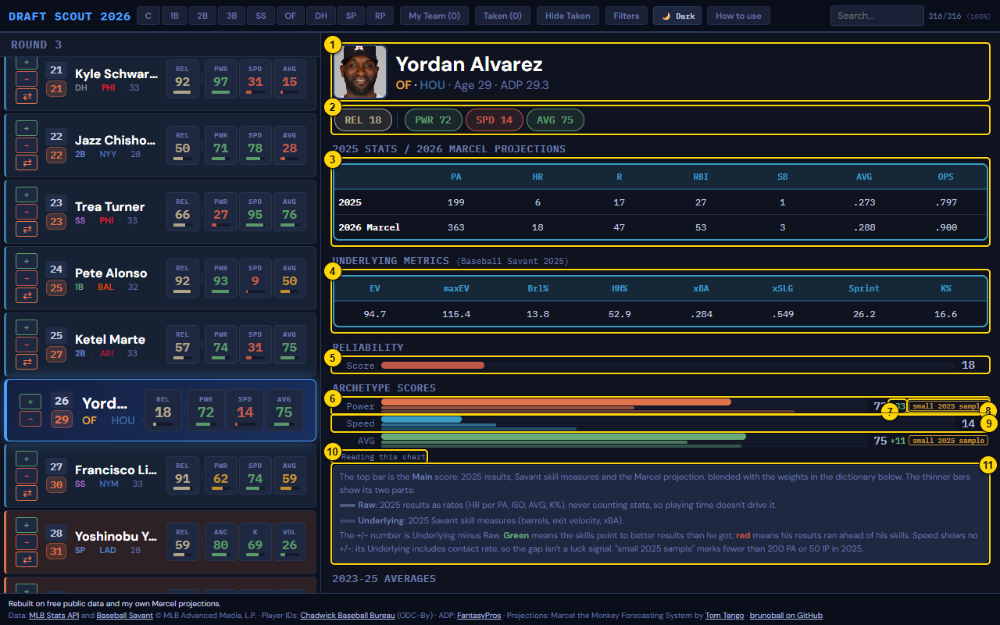

1. **Header.** Photo, name, position, team, age and exact ADP.
2. **Score ovals.** REL (reliability) and the three archetype scores, coloured like the list pills.
3. **2025 Stats / 2026 Marcel Projections.** Two rows: the player's 2025 MLB line and his Marcel projection for 2026, in the same columns. For hitters: PA, HR, R, RBI, SB, AVG, OPS. For starters: IP, QS, K, ERA, WHIP, K/9. If he didn't play in MLB in 2025, the 2025 row shows dashes.
4. **Underlying Metrics (Baseball Savant 2025).**
   - For hitters: average exit velocity (EV), max exit velocity, barrel %, hard-hit %, expected batting average (xBA), expected slugging (xSLG), sprint speed and K%.
   - For starters: fastball velocity, whiff %, K%, BB%, xERA, hard-hit % allowed and ground-ball %.
5. **Reliability bar.** The reliability score (the REL oval) as a bar, labelled Score. What goes into it is explained in the Score Dictionary.
6. **Archetype Scores.** One bar per archetype (Power, Speed and AVG for hitters), with the score on the right. These are the same scores as the ovals and the list pills.

Below the archetype bars, **2025 Results vs Skills** compares how each archetype scored on 2025 results with how it scored on 2025 Statcast skill measures.

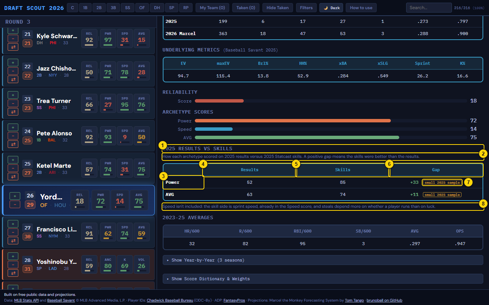

1. **Section title.** 2025 Results vs Skills.
2. **Intro line.** "How each archetype scored on 2025 results versus 2025 Statcast skills. A positive gap means the skills were better than the results."
3. **Rows.** One row per archetype: Power and AVG for hitters, Anchor and K Arm for starting pitchers.
4. **Results.** The archetype scored on 2025 results as rates (for example home runs per plate appearance, batting average, ERA, quality starts per start), 0–100.
5. **Skills.** The archetype scored on 2025 Statcast skill measures (for example barrel rate, exit velocity, expected batting average, xERA, whiff rate), 0–100.
6. **Gap.** Skills minus Results. It's green above +5, red below −5 and grey in between.
7. **Small 2025 sample flag.** A yellow "small 2025 sample" tag appears next to each Gap for a player with fewer than 200 PA (hitters) or 50 IP (pitchers) in 2025.
8. **Note on what isn't included.** On a hitter's page: "Speed isn't included: the skill side is sprint speed, already in the Speed score, and steals depend more on whether a player runs than on luck." On a starting pitcher's page: "Volatility isn't included: it's already built from Statcast contact numbers, so there's no separate results version to compare against."

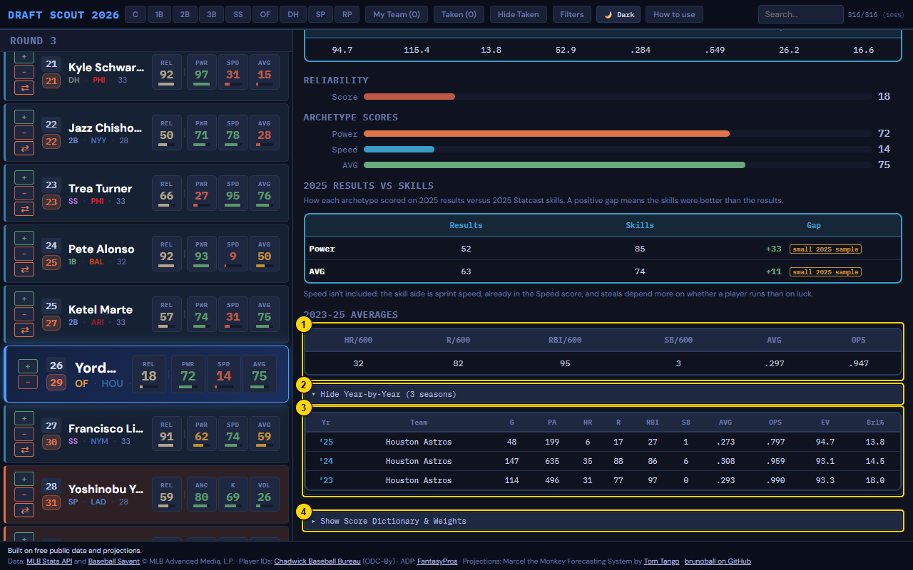

1. **Averages.** Totals over the seasons the player played within 2023–25, turned into rates. The label names those seasons: "2023-25 averages", "2024-25 averages" or "2025 averages" (or, with a gap, for example "2023, 2025 averages").
   - For hitters: HR, R, RBI and SB per 600 plate appearances, then AVG and OPS.
   - For pitchers: ERA, WHIP, K/9, and barrel %, hard-hit % and fastball velocity weighted by batters faced or innings.
2. **Year-by-Year toggle.** Shows or hides the season-by-season table. The label says how many seasons there are.
3. **Year-by-Year table.** One row per season, newest first, with the team that season.
   - For hitters: games, PA, HR, R, RBI, SB, AVG, OPS, exit velocity and barrel %.
   - For starters: games, starts, IP, QS, W, L, K, ERA, WHIP, K/9 and fastball velocity.
4. **Score Dictionary & Weights.** Opens the weights panel. See [section 4](#4-score-weights-and-sliders).

**Starting pitchers** have Anchor and K Arm bars, laid out like the hitters' three, plus a separate **Volatility** bar, where a higher score means a riskier pitcher.

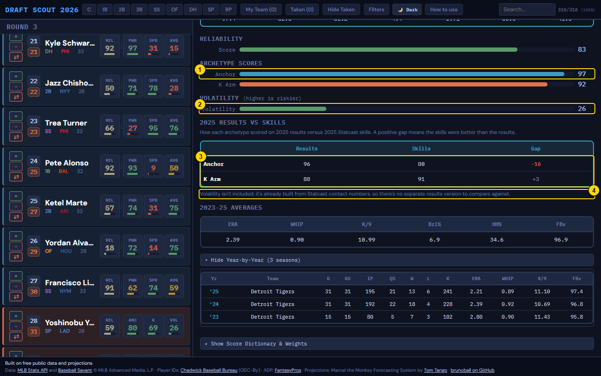

1. Anchor and K Arm bars.
2. Volatility bar (higher is riskier, so the colours are reversed).
3. 2025 Results vs Skills rows for Anchor and K Arm.
4. The note on why Volatility isn't included.

**Relievers** have no scores. Their page shows the note "No closer score: Marcel doesn't project saves." (with "Closer in 2025" for pitchers who closed in 2025), the 2025 Stats / 2026 Marcel Projections table with saves in place of quality starts (Marcel's saves column is a dash), the averages table and the year-by-year table.

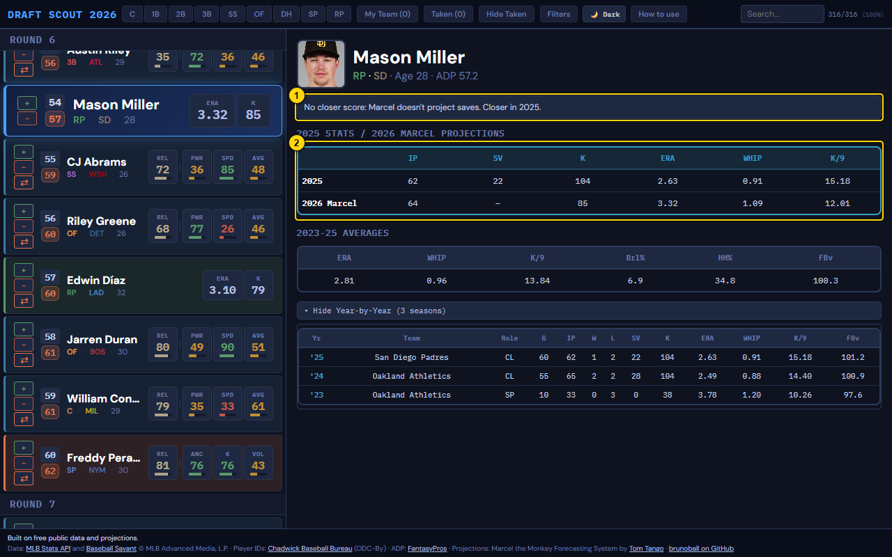

1. The no-score note.
2. 2025 Stats / 2026 Marcel Projections table. Marcel has no saves projection, so that cell shows a dash.

**Unscored players** (no MLB time in 2023–25) show only the header and a note explaining that there's no projection or score.

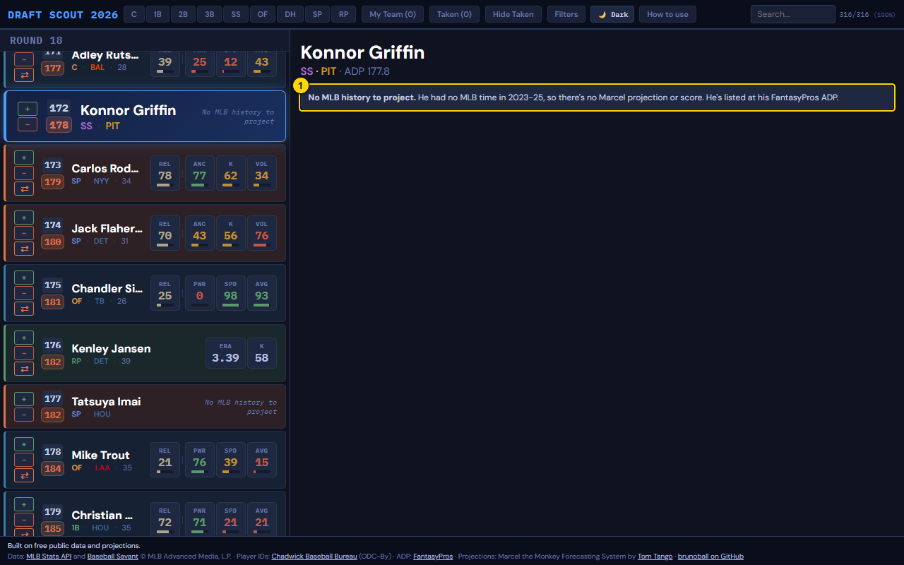

1. "No MLB history to project" note.

**Shohei Ohtani** appears twice, once as a hitter and once as a starting pitcher. FantasyPros gives him one ADP (1.3), which his hitter entry uses. Yahoo lists his pitching separately, so his pitcher entry uses an ADP of 50 that I set by hand. A note under his name says so.

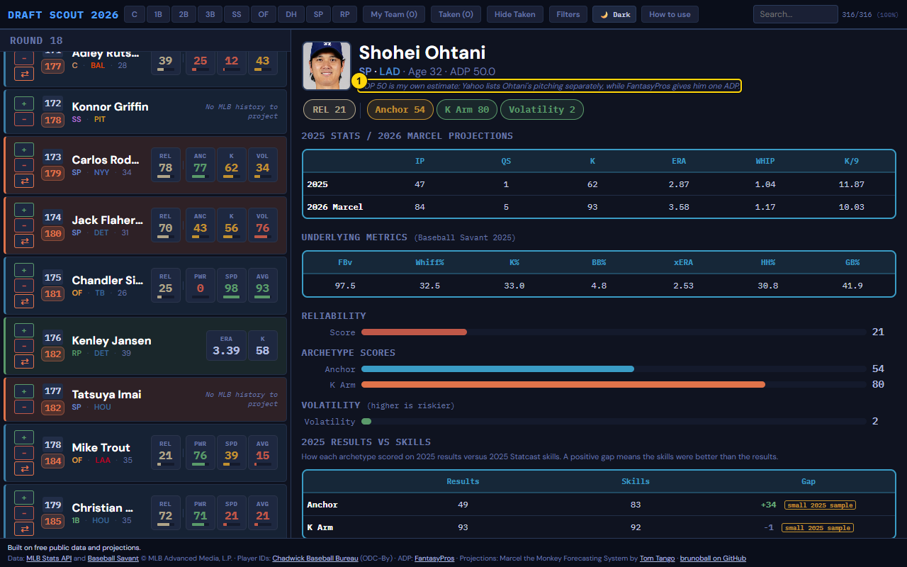

1. The ADP note.

---

## 4. Score weights and sliders

Open a hitter or starting pitcher, then click **Show Score Dictionary & Weights** at the bottom of the player page. Each archetype has one table. Its first weight column, **Score**, drives the scores shown throughout the tool, and its sliders change that player group's weights (hitters, or starting pitchers) everywhere. The **2025 Results** and **2025 Skills** columns are the fixed weights behind the 2025 Results vs Skills section on the player page.

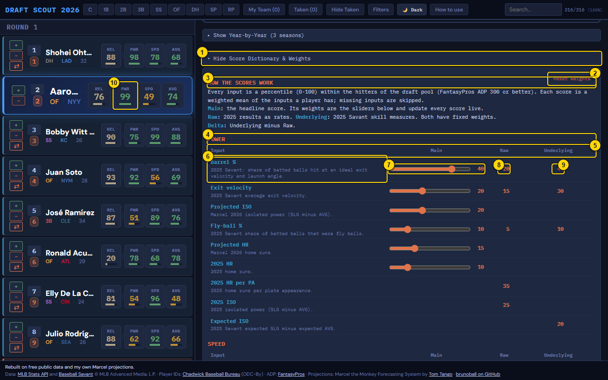

1. **Show / Hide Score Dictionary & Weights.** Opens and closes the panel.
2. **Reset weights.** Puts every Score weight for this group back to its starting value. Every score returns to its default, and the saved weights are reset too.
3. **How the scores work.** A short description of percentiles, the Score, 2025 Results, 2025 Skills and the gap.
4. **Archetype heading.** One table per archetype (Power, Speed and AVG for hitters; Anchor, K Arm and Volatility for starters).
5. **Table columns.** Input, Score, 2025 Results and 2025 Skills. Every input used by any of the three has one row. A blank cell means that column doesn't use the input.
6. **Input.** The input's name, with what it is and where it comes from (2025 MLB, 2025 Savant or the Marcel projection) underneath.
7. **Score weight slider.** Sets the input's weight in the archetype score, from 0 to 50, and the number beside it shows the value. Weights don't need to add up to 100: each score divides by the total of its weights. Moving a slider updates, as you drag, the score in the list pills, the score ovals, the archetype bar and the My Team averages. A weight of 0 leaves that input out.
8. **2025 Results weight.** Fixed; shown in the same number format as Score.
9. **2025 Skills weight.** Fixed; shown in the same number format.
10. **The list updates too.** Here the barrel weight was raised to 40, and Aaron Judge's PWR pill in the list updated at once.

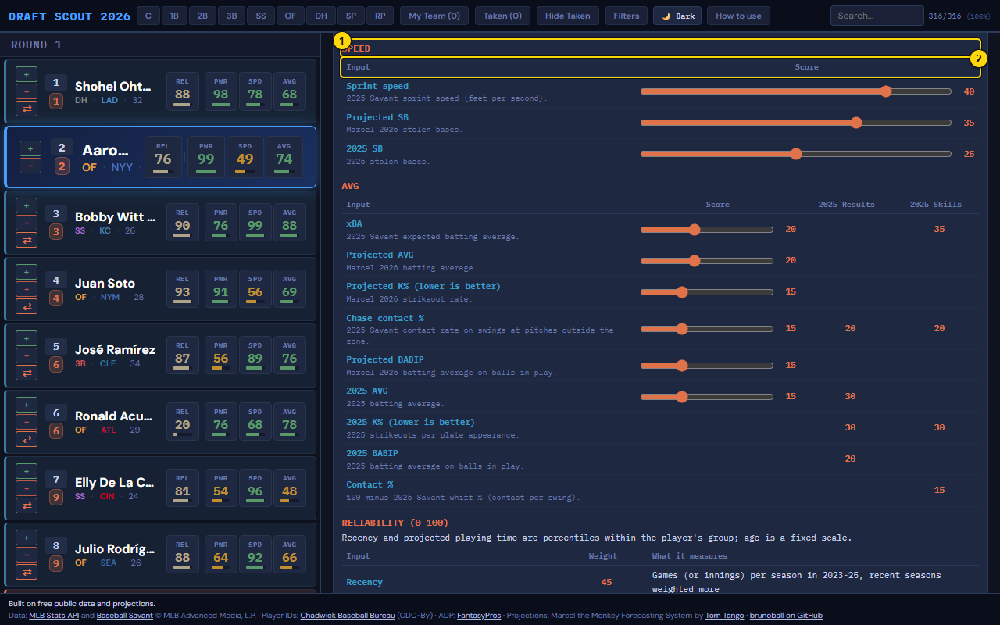

1. **Speed** (and **Volatility** for starters) has no 2025 Results vs Skills comparison.
2. Its table has the Input and Score columns only.

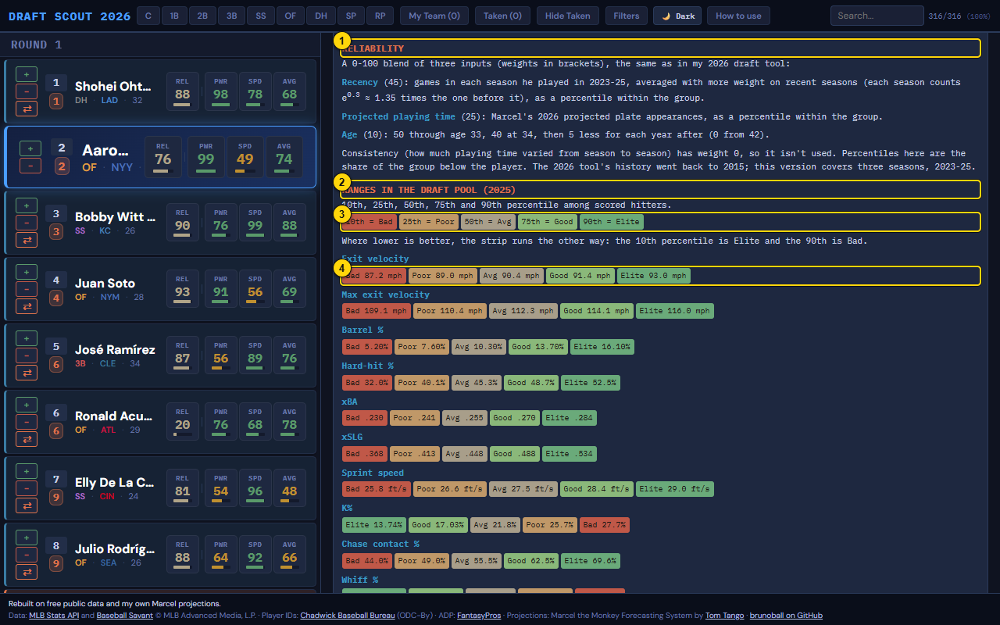

1. **Reliability (0-100).** The heading, with one line under it: "Recency and projected playing time are percentiles within the player's group; age is a fixed scale."
2. **Reliability table.** Input, weight and what it measures:
   - Recency (45): games (or innings) per season in 2023-25, recent seasons weighted more;
   - Projected playing time (25): Marcel's 2026 projected PA (or IP);
   - Age (10): full credit through 33, less each year after.
3. **Ranges in the draft pool.** The heading, with the key Savant numbers for this group listed below it.
4. **Colour legend.** Which colour stands for the 10th, 25th, 50th, 75th and 90th percentile (Bad, Poor, Avg, Good, Elite), in the same colours as the strips.
5. **Range strip.** The five percentile values for one stat among the scored players in the pool. For stats where lower is better (a hitter's K% and whiff %; a pitcher's BB%, xERA, and hard-hit, barrel, zone-contact and HR-per-fly-ball rates allowed), the labels and colours run from Elite to Bad.

Weight changes are saved in your browser and come back when you reload. **Reset weights** also resets the saved weights for that group.

---

## 5. Filters, search and position chips

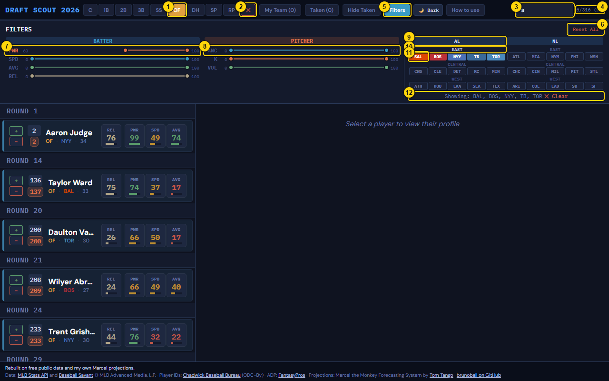

1. **Position chip.**
   - Click a chip to show only that position; it fills with the position's colour.
   - Click more chips to add positions, and click an active chip to remove it.
   - OF includes players listed as CF or RF. SP is every starting pitcher and RP every reliever.
2. **✕ (clear positions).** It appears when any position chip is on, and turns them all off.
3. **Search.** Shows only players whose name contains what you type, upper or lower case alike. Clear the box to show everyone again.
4. **Player count.** Changes as you filter (here, 6 of 316).
5. **Filters chip.** Opens and closes this panel. The chip is blue while the panel is open.
6. **Reset All.** Clears every score range and team choice in the panel. It doesn't clear the position chips or the search.
7. **Batter score ranges (Power, Speed, AVG, REL).**
   - Each one is a two-handled slider from 0 to 100. Drag the handles to keep only players whose score falls in that range.
   - The label lights up in the score's colour while a range is set, and the numbers at each end show its limits.
   - Players who don't have that score (pitchers, for a hitter score) aren't filtered out by it.
   - REL applies to both hitters and starting pitchers.
8. **Pitcher score ranges (Anchor, K Arm, Volatility).** These work the same way for starting pitchers.
9. **League (AL / NL).** Selects or clears all 15 teams in that league.
10. **Division label** (East, Central, West). Selects or clears the five teams in that division.
11. **Team button.** Selects or clears one team, and fills with the team colour when selected. With any team selected, the list shows only those teams.
12. **Showing: … ✕ Clear.** Lists the selected teams. ✕ Clear removes all of them.

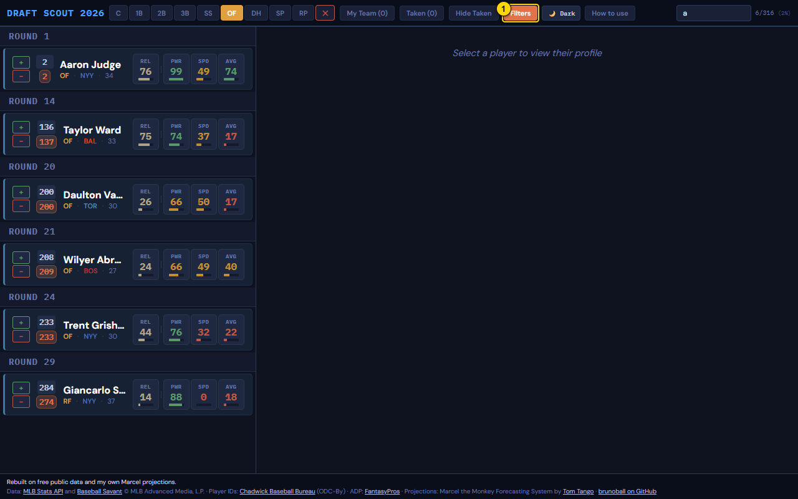

1. With the panel closed, the **Filters** chip turns orange while any score range or team filter is active.

All filters, the position chips and the search combine: a player has to pass all of them to stay in the list. Filtering never changes a player's rank or round: in the screenshot above, the remaining players keep ranks 2, 136, 200 and so on, under their real round dividers.

---

## 6. Draft tracking

Use **+** on a card for your own picks and **−** for players other teams take (see [section 2](#2-main-player-list)). Each mark adds the player to the draft order in the order you click.

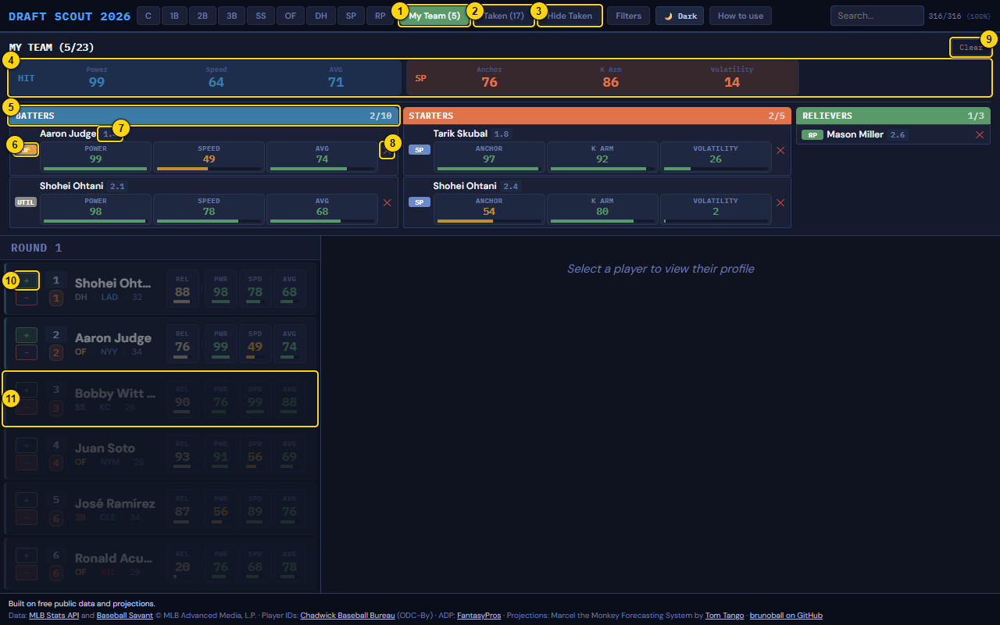

1. **My Team (n).** Opens the panel; n is your number of picks.
2. **Taken (n).** Every pick recorded, yours and others'.
3. **Hide Taken.** See below.
4. **Team averages.** The average score of your hitters (Power, Speed, AVG) and your starters (Anchor, K Arm, Volatility). Relievers aren't averaged, because they have no scores.
5. **Roster columns.** Batters, starters and relievers, with filled slots out of the total. The roster is C, 1B, 2B, 3B, SS, three OF and two UTIL; four SP and one UP (extra pitcher); three RP; then five bench spots.
6. **Slot badge.**
   - Each player fills the slot for his position first; DH-only hitters and extra players at a position go to UTIL, and extra starters to UP.
   - When those are full, players go to the bench, and anyone beyond the bench is listed under **Over Roster**.
   - Within a column, players are listed in the order you drafted them.
7. **Pick number.** Round.pick in a 10-team draft (1.4 is the 4th pick of round 1), based on all recorded picks.
8. **✕ (remove).** Removes the player from your picks. He leaves My Team and the draft board, and every later pick moves up one.
9. **Clear.** Removes every recorded pick, yours and others', including the saved copy in your browser.
10. **+ filled green.** On the card in the list, a filled + means the player is one of your picks. His card is faded.
11. **Taken card.** A player marked − is faded more strongly.

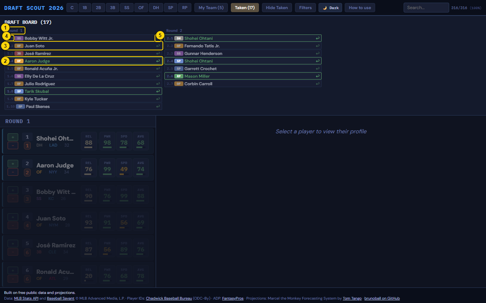

Click **Taken (n)** to open the draft board. My Team and the draft board can be open at the same time.

1. **Round label.** Picks grouped in rounds of 10, three rounds per row.
2. **Your pick.** Outlined in green, with the name in green.
3. **Another team's pick.** Dimmed.
4. **Pick number.** Round.pick.
5. **↩ (undo).** Removes that pick. Later picks move up one. Clicking a name on the board opens that player's page.

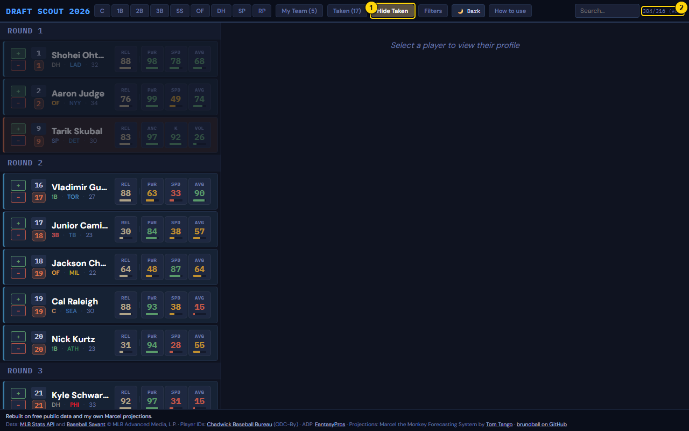

1. **Hide Taken on.** Players marked − disappear from the list. Your own picks stay visible (faded). Click again to show everyone.
2. **Player count.** Drops by the number of hidden players. The ranks of the players left don't change.

---

## 7. Compare

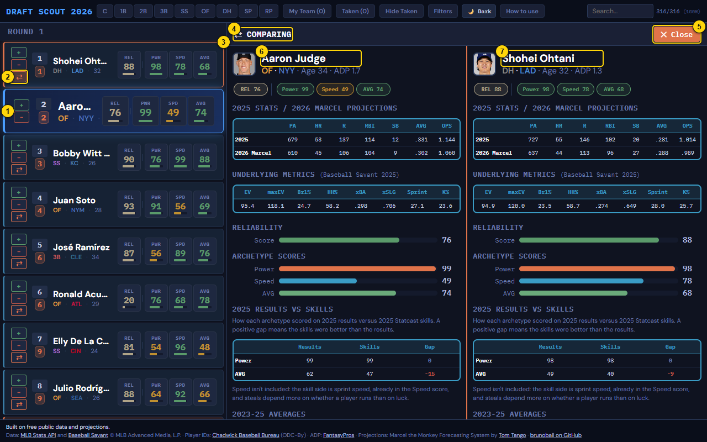

1. **Open player.** Open a player first.
2. **⇄ on another card.** Opens the comparison, and the button fills orange. Click it again (or Close) to end the comparison. Players without scores (unscored rookies) have no ⇄ button.
3. **Compared player's card.** Outlined in orange in the list.
4. **COMPARING header.** Stays at the top of the panel while you scroll.
5. **✕ Close.** Returns to the single player page.
6. **Left column.** The open player's page, in a compact layout.
7. **Right column.** The compared player's page.

Both columns have the same sections as the player page, apart from the Score Dictionary, which is hidden while comparing. Clicking a different card in the list makes that player the left-hand player and keeps the comparison open.

---

## 8. Settings and phone view

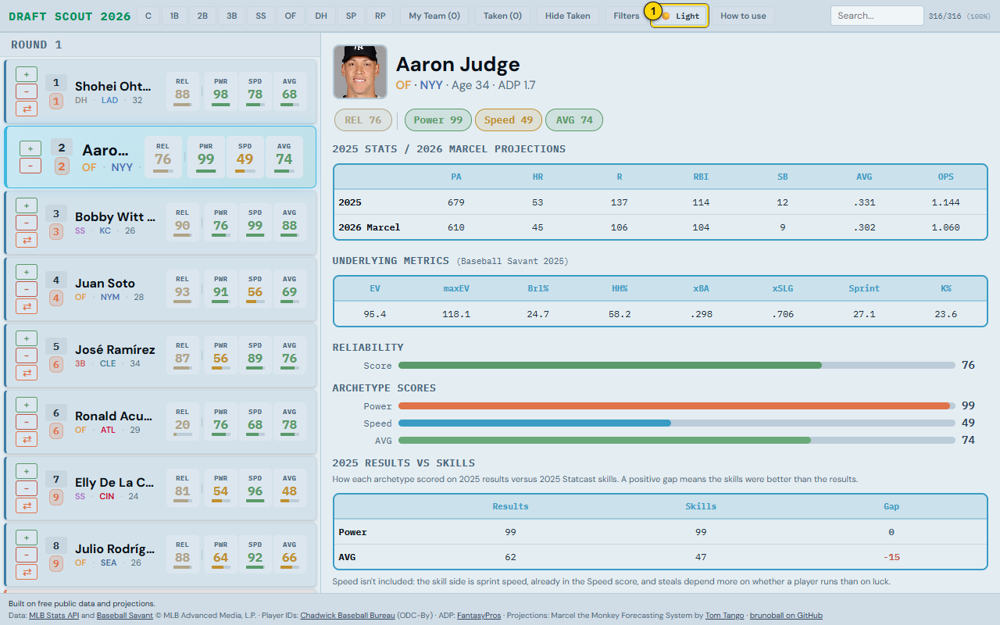

1. **Theme button.** Switches between the dark and light themes, and the label changes to match (🌙 Dark or ☀️ Light). Pressing **T** (capital T, with Shift) does the same, except while typing in the search box. The choice is saved in your browser and used on your next visit.

**Phone view.** On screens 768 px wide or narrower, the layout changes:
- The header controls wrap onto several lines.
- The player list takes the full width.
- Player pages open in a panel that slides up from the bottom.

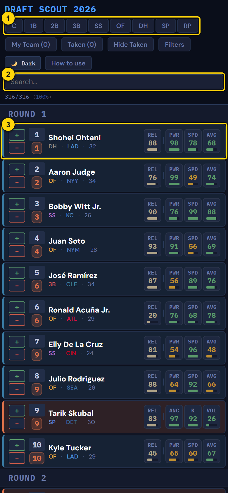

1. Position chips, panel chips and the theme button wrap onto extra lines.
2. The search box runs the full width.
3. Player cards are smaller, with the same buttons and pills.

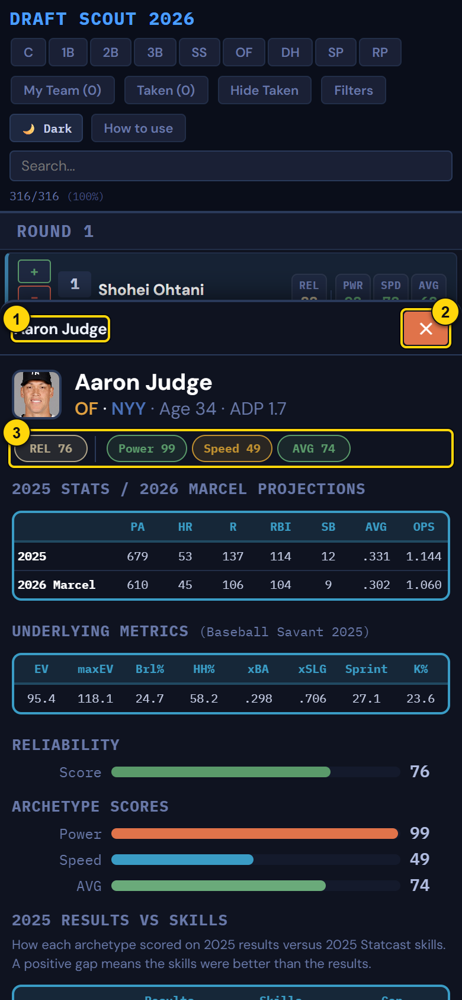

1. **Bottom panel header.** The player's name, or "Comparing" during a comparison.
2. **✕.** Closes the panel. It also ends any comparison.
3. **Player page.** The same sections as on a laptop, in the compact layout. The panel scrolls on its own. The Score Dictionary and weight sliders aren't available in the phone panel.

---

## What the scores mean

Every input to a score is a **percentile** from 0 to 100, worked out within one group of players in the draft pool: either the hitters or the starting pitchers. A 90 means the player is ahead of about 90% of that group on that input. Each score is a weighted average of the percentiles the player has. Inputs a player doesn't have (for example, no Savant data) are left out rather than counted as zero.

- **The archetype scores** (Power, Speed, AVG; Anchor, K Arm, Volatility) are the scores in the pills, ovals, bars, filters and My Team averages. Each mixes 2025 results, 2025 Baseball Savant skill measures and the 2026 Marcel projection. Their weights are the sliders in [section 4](#4-score-weights-and-sliders).
- **2025 Results vs Skills** on the player page scores Power, AVG, Anchor and K Arm twice more:
  - **Results** uses 2025 results as rates, such as home runs per plate appearance, batting average, ERA and quality starts per start. It never uses totals, so how much a player played doesn't move it.
  - **Skills** uses 2025 Statcast skill measures, such as barrel rate, exit velocity, expected batting average, xERA, hard-hit rate allowed and whiff rate.
  - **Gap** is Skills minus Results. A positive gap means the skill measures rank higher than the 2025 results; a negative gap means the results rank higher than the skill measures.
  - Gaps for players with under 200 PA or 50 IP in 2025 carry the "small 2025 sample" flag.
  - Speed isn't included: the skill side is sprint speed, already in the Speed score, and steals depend more on whether a player runs than on luck.
- **Volatility** (starting pitchers only) is built from home runs per fly ball, hard-hit rate and barrel rate allowed. A higher score means a riskier pitcher. It isn't in 2025 Results vs Skills, because it's already built from Statcast contact numbers.
- **Reliability** is a 0–100 blend of recent playing time, projected playing time and age. The Score Dictionary lists its inputs and weights.

The [pipeline README](../data-pipeline/README.md) lists every input, its source and its weight.

## What's saved between visits

These are saved in your browser on this device and come back when you reload or reopen the page:
- **Your picks and other teams' picks**, so the draft board, My Team and the faded cards all come back.
- **Score weights**, for hitters and for starting pitchers.
- **The theme.**

These reset on every reload: filters, team choices, position chips, search, Hide Taken, the open player, the comparison and the open or closed state of panels and toggles.

**Clear** (in My Team) removes the saved picks, and **Reset weights** resets the saved weights for that group. The saved copy belongs to this browser only: another browser or device starts fresh, and clearing your browser's site data removes it. If your browser blocks storage (for example in some private windows), the tool still works, but nothing is saved between visits.
