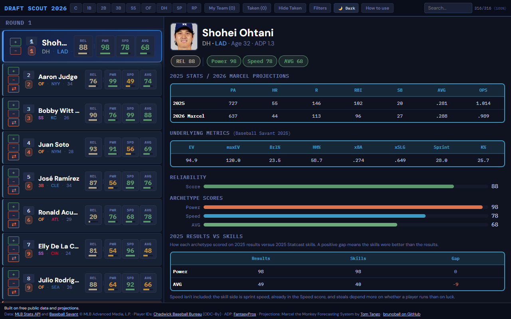

# Draft Scout 2026

Draft Scout is a fantasy baseball draft tool built on free public data and projections. It lists the top 300 players by FantasyPros ADP, scores hitters and starting pitchers on six archetypes, and keeps track of your picks and everyone else's during the draft. It describes players; it doesn't tell you who to draft.

**[Try it](https://mike-morreale-14.github.io/brunoball/draft-tool/)**

## How to use it

1. Click any player card to open their player page, with 2025 stats, the 2026 projection, Statcast metrics and scores.
2. Open **Score Dictionary & Weights** at the bottom of a player page and drag the sliders to change how each score is weighted.
3. Use the position chips, the search box and **Filters** to narrow the list by score range, position or team.
4. Mark picks with **+** (yours) or **−** (another team's); **My Team** and **Taken** show your roster and the draft board, saved in your browser.
5. With a player open, click **⇄** on another card to compare the two side by side.
6. Switch between dark and light themes with the theme button (or Shift+T).

## How the scores work

Every input is a percentile (0 to 100) within its group, hitters or starting pitchers, and each score is a weighted average of those percentiles, mixing 2025 results, 2025 Statcast skills and the 2026 Marcel projection.

| Archetype | Group | What it measures |
|---|---|---|
| Power | Hitters | Home run and extra-base power: barrels, exit velocity, fly balls, ISO and home runs. |
| Speed | Hitters | Stolen bases: sprint speed plus 2025 and projected steals. |
| AVG | Hitters | Batting average: expected batting average, contact, strikeout rate and BABIP. |
| Anchor | Starting pitchers | A steady innings eater: projected innings, quality starts, ERA and WHIP, plus xERA and hard-hit rate allowed. |
| K Arm | Starting pitchers | Strikeouts: fastball velocity, whiff rate, K% and K/9, and zone contact allowed. |
| Volatility | Starting pitchers | Risk of blow-ups from hard contact: home runs per fly ball, hard-hit and barrel rate allowed. Higher means riskier. |

**2025 Results vs Skills.** Each player page also scores Power, AVG, Anchor and K Arm two more ways: on 2025 results as rates (so playing time doesn't drive it) and on 2025 Statcast skill measures. The gap is Skills minus Results, so a positive gap means the skills were better than the results. Players with fewer than 200 PA or 50 IP in 2025 get a "small 2025 sample" flag. Speed isn't included: the skill side is sprint speed, already in the Speed score, and steals depend more on whether a player runs than on luck. Volatility isn't included: it's already built from Statcast contact numbers, so there's no separate results version to compare against.

**Reliability** (REL) is a 0–100 blend of recent playing time, projected playing time and age.

Exact inputs and weights: [data pipeline](../data-pipeline/).

## Data and credits

Stats and Statcast data come from the MLB Stats API and Baseball Savant (© MLB Advanced Media, L.P.), player IDs from the Chadwick Baseball Bureau register (ODC-By), ADP from FantasyPros, and the 2026 projections from my implementation of Tom Tango's Marcel method. The [pipeline README](../data-pipeline/README.md) covers every source and how the data is built.

## Run it locally

From this folder, run any static file server, for example `python -m http.server 8000`, then open http://localhost:8000.
It needs a server because the page loads its data with `fetch`; opening `index.html` straight from disk won't load the players.
