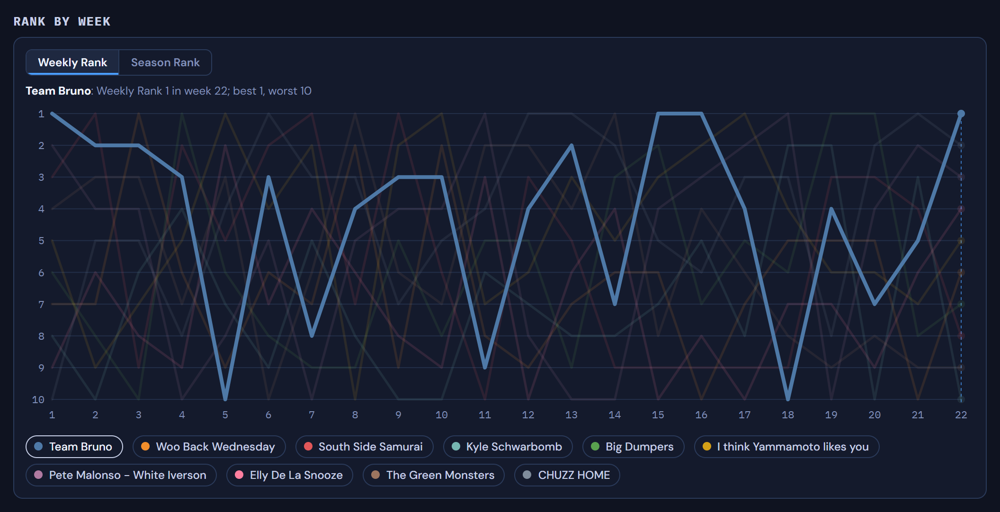
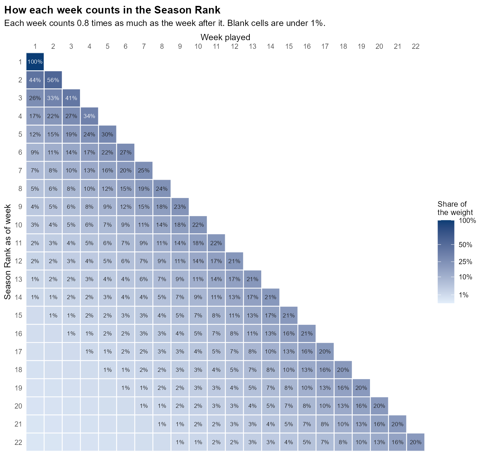

# Power Rankings 2026

My league is 10 teams, head to head across 12 categories (R, HR, RBI, SB, AVG, OPS for hitters; W, SV, K, ERA, WHIP, QS for pitchers). A weekly matchup only shows how a team did against one opponent. This page ranks teams on roto points instead, which compare every team with every other team in every category, so a team's rank doesn't depend on who it happened to play. There are two rankings: a Weekly Rank for each week, and a Season Rank that blends every week so far.

**[View the rankings](https://mike-morreale-14.github.io/brunoball/power-rankings/)**

[](https://mike-morreale-14.github.io/brunoball/power-rankings/)

## How it works

### Weekly Rank (Current Week)

One week only. Each team is ranked 1 to 10 in each of the 12 categories on that week's stats, with 10 points for first and ties split (lower is better for ERA and WHIP). The points are summed, out of 120.

### Season Rank

The Season Rank blends each week's roto points, not raw stats. Weeks differ in length: in my league's data, week 1 has about half a normal week's counting stats, and week 17, which spans the All-Star break, has about one and a half times as much. Raw counting stats aren't comparable from week to week, but roto points put every week on the same 1 to 10 scale. Each week counts 0.8 times as much as the week after it.



### Record vs. league, luck and 70+ weeks

- **Record vs. league.** A team's category record against all 9 other teams that week: 108 category matchups, shown as a win-loss-tie record.
- **Avg.** The record vs. league divided by 9: the record against a typical opponent.
- **Actual.** The category record against that week's real opponent.
- **Luck.** The actual record compared with the record vs. league: actual win share minus win share vs. the league, with ties counted as half a win. A positive number means the team won more categories against its real opponent than its record vs. the league would suggest; a negative number means fewer.
- **70+ Wk.** The number of weeks a team won 70 or more of its 108 category matchups vs. the league.

In the Season Rank table, the Avg and Actual records are season totals, without weighting.

## Reading the page

- Pick a week with the menu or the arrows; it opens on week 22, the last week of the regular season.
- **Weekly Rank (Current Week)** shows that week: each team's stats in the 12 categories, its roto total, its record vs. league, and its actual and luck numbers.
- **Season Rank** shows the weighted category points and the season's records up to that week.
- Teams are rows, sorted by rank. Cells are shaded from red (lowest in the column) to green (highest), by rank, so a low ERA is green. Luck is green above +0.05 and red below −0.05; 70+ Wk is green at 3 or more.
- The chart shows every team's rank after each week, as Weekly Rank or Season Rank. Hover over a line or a team name to pick it out.

## Data and rerunning

The data is my league's weekly Yahoo results, in [`data/weekly_stats_2026.csv`](data/weekly_stats_2026.csv): one row per team per week, with the opponent, the 12 categories and the category record.

To rebuild `data/rankings.json` and `weighting-heatmap.png`, run this from the brunoball folder:

```
Rscript power-rankings/build_rankings.R
```

The script prints its checks and stops without writing anything if one fails. The page is plain HTML, CSS and JavaScript; to view it locally, serve the brunoball folder with any static file server (for example `python -m http.server 8000`) and open http://localhost:8000/power-rankings/.
