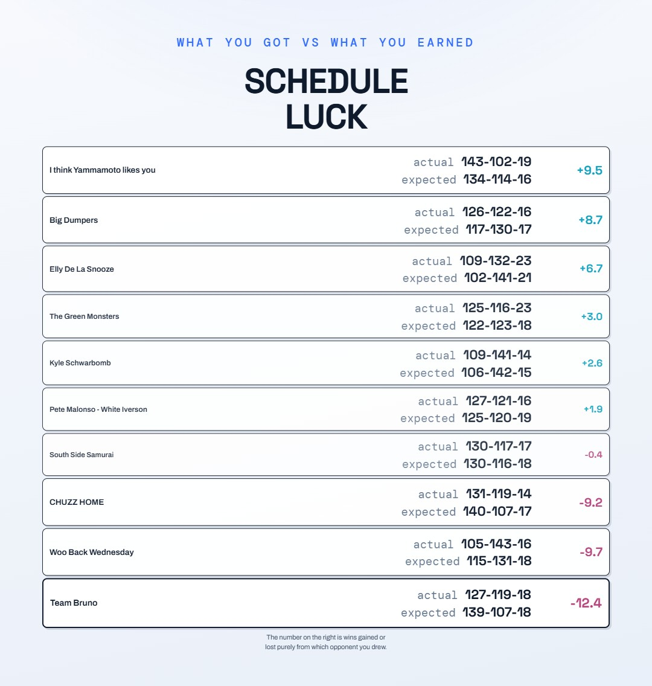
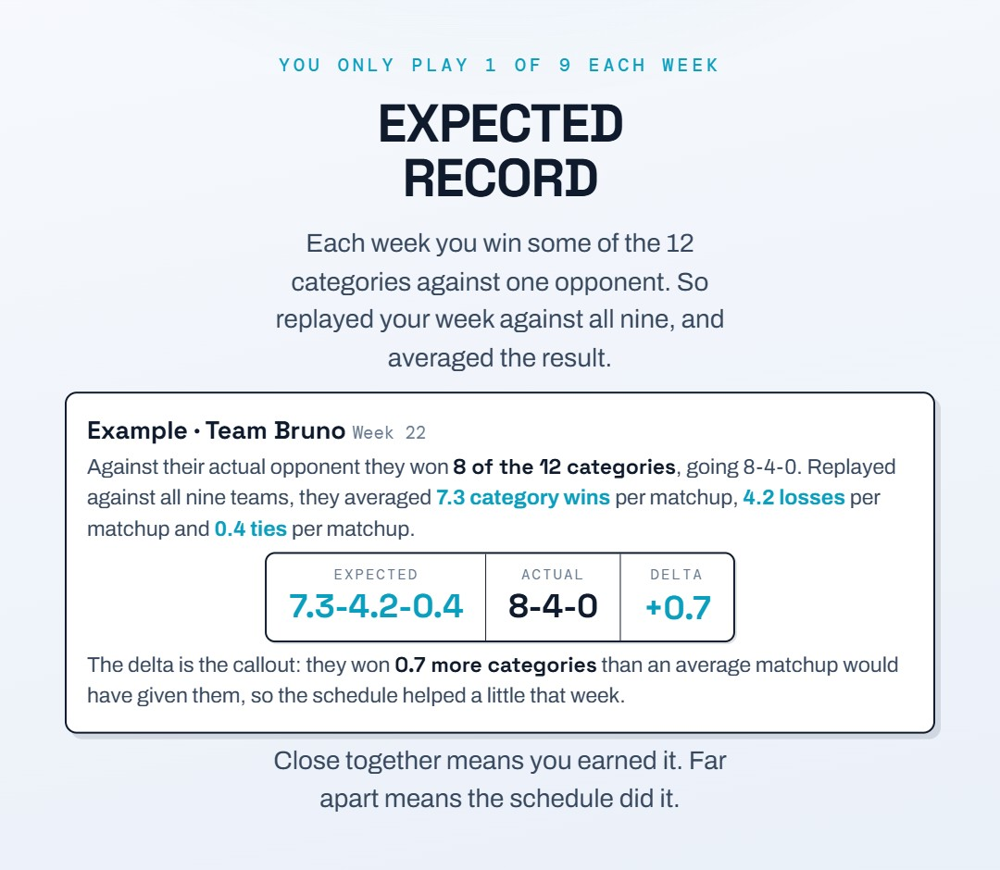

# Season Wrapped 2026

An end-of-season recap I made for the league, inspired by Spotify Wrapped. It covers the 22-week regular season in 24 slides: the best and worst weeks, who led each category, schedule luck, and a slide for each team.

**[View the slides](https://mike-morreale-14.github.io/brunoball/wrapped/)**

Power Score here is each team's average weekly place in a category across all 22 weeks, weighted equally; the [power rankings](../power-rankings/) page's Season Rank weights recent weeks more.

Every slide is in [`slides/`](slides/) as a JPG. The data is my league's weekly Yahoo results, the same data as the power rankings ([`weekly_stats_2026.csv`](../power-rankings/data/weekly_stats_2026.csv)).
