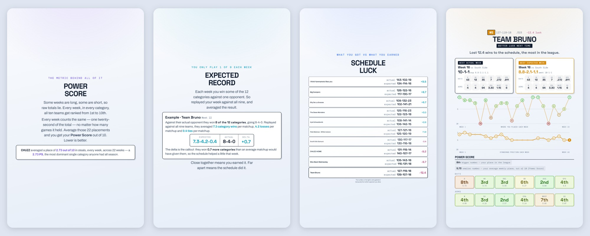

# Season Wrapped 2026

An end-of-season recap I made for the league, inspired by Spotify Wrapped: 24 slides on the 2026 regular season.

**[View the slides](https://mike-morreale-14.github.io/brunoball/wrapped/)**

## What's in it

- **The season's extremes.** The best and worst weeks, the two near-sweeps, and the best and worst single-week mark in each category.
- **Power Score and Category Kings.** Each team's average weekly place in each category, out of 10, and the team that led each category.
- **Expected record and schedule luck.** Each week replayed against all nine other teams. The gap between a team's actual and expected record is the wins it gained or lost from the schedule.
- **A slide for each team.** Its best weeks, where it placed each week, its standings position each week, and its place in every category.

Power Score here is each team's average weekly place in a category across all 22 weeks, weighted equally; the [power rankings](../power-rankings/) page's Season Rank weights recent weeks more.

## Data

My league's weekly Yahoo results, the same data as the power rankings ([`weekly_stats_2026.csv`](../power-rankings/data/weekly_stats_2026.csv)). Every slide is in [`slides/`](slides/) as a JPG.
